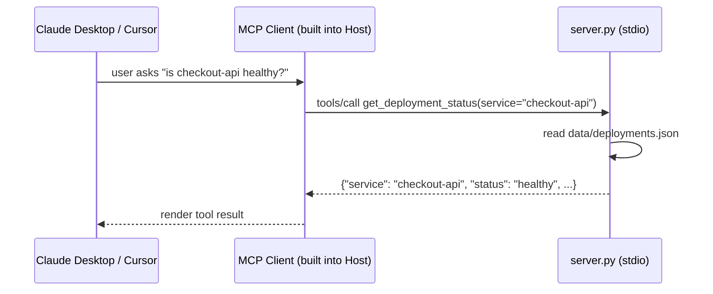

# Use Case 1: Custom MCP Server — Implementation Walkthrough

This documents exactly what was built, in order, so you can follow the same steps to build
your own MCP server from scratch. For "how do I run this," see [README.md](README.md) — this
document is "what did we build and why."

## What this is

A minimal, fully offline MCP (Model Context Protocol) server exposing three internal-tooling
tools, teaching the mechanics of MCP before adding authentication (use-case-2), a real
directory service (use-case-3), or a real AI/ML serving platform (use-case-4).

## Architecture



The server runs as a local subprocess over **stdio** — no network port, no auth. The MCP
client (built into Claude Desktop or Cursor) spawns `python server.py`, sends JSON-RPC
requests over its stdin/stdout, and the server responds the same way.

## Step 1: Project scaffold

Created the directory structure and static data the tools would read from — no code yet:

- `requirements.txt` — pins `mcp`, `pytest`, `pytest-asyncio`, `anyio`
- `pytest.ini` — sets `asyncio_mode = auto` so async test functions run without extra decorators
- `data/deployments.json` — mock deployment status for 3 services (`checkout-api` healthy,
  `payments-service` degraded, `inventory-worker` down)
- `data/knowledge_base/*.md` — 3 short internal runbook-style docs (onboarding, incident
  response, deployment process)
- `.gitignore` — ignores `tickets.json` (runtime-generated) and Python cache directories

## Step 2: `get_deployment_status` tool

The first tool, and the first version of `server.py`. Set up the `FastMCP` app object and
one read-only tool:

```python
from mcp.server.fastmcp import FastMCP

mcp = FastMCP("enterprise-tools-demo")

@mcp.tool()
def get_deployment_status(service: str) -> dict:
    """Get the current deployment status for an internal service."""
    deployments = _load_deployments()
    if service not in deployments:
        raise ValueError(f"Unknown service: {service}. Known services: ...")
    return {"service": service, **deployments[service]}
```

Built test-first: wrote `tests/test_tools.py` with 2 tests (known service, unknown service)
before the function existed, confirmed they failed for the right reason
(`ModuleNotFoundError`), then implemented the function until they passed.

Key lesson: raising a plain `ValueError` from a tool is enough — the MCP SDK's own dispatch
loop catches it and turns it into a `CallToolResult(isError=True)` for the client. No
try/except needed inside the tool itself.

## Step 3: `search_knowledge_base` tool

Added a second tool to the same `server.py`, same TDD pattern (3 new tests added first):

```python
@mcp.tool()
def search_knowledge_base(query: str) -> list[dict]:
    """Search the internal knowledge base for documents matching a query."""
    if not query.strip():
        raise ValueError("query must not be empty")
    matches = []
    needle = query.lower()
    for doc_path in sorted(KNOWLEDGE_BASE_DIR.glob("*.md")):
        text = doc_path.read_text(encoding="utf-8")
        if needle in text.lower():
            idx = text.lower().index(needle)
            start = max(0, idx - 80)
            end = min(len(text), idx + 80)
            snippet = text[start:end].replace("\n", " ").strip()
            matches.append({"file": doc_path.name, "snippet": snippet})
    return matches
```

Does a case-insensitive substring search across the 3 knowledge-base markdown files and
returns the file name plus a short snippet around the first match. The `max(0, idx-80)` /
`min(len(text), idx+80)` clamps matter — without them, a match near the very start or end of
a file would produce a broken slice.

## Step 4: `create_support_ticket` tool

The third tool — the first one with a **side effect** (writes to disk), unlike the two
read-only tools before it:

```python
@mcp.tool()
def create_support_ticket(title: str, description: str) -> dict:
    """File an internal support ticket."""
    if not title.strip():
        raise ValueError("title must not be empty")
    tickets = _load_tickets()
    ticket = {
        "id": len(tickets) + 1,
        "title": title,
        "description": description,
        "created_at": datetime.now(timezone.utc).isoformat(),
        "status": "open",
    }
    tickets.append(ticket)
    _save_tickets(tickets)
    return ticket
```

Appends to `tickets.json` (gitignored, created on first use) with an auto-incrementing ID,
a UTC timestamp, and `status: "open"`. Tests use `monkeypatch` to redirect `TICKETS_FILE` to
a temp path, so running the test suite never touches your real `tickets.json`.

## Step 5: End-to-end protocol integration test

Everything up to this point was unit-tested by calling the Python functions directly — fast,
but it doesn't prove the server actually works *as an MCP server*. This step adds
`tests/test_mcp_protocol.py`, which spawns `server.py` as a real subprocess and drives it
through the actual MCP wire protocol using the SDK's own client:

```python
async with stdio_client(params) as (read, write):
    async with ClientSession(read, write) as session:
        await session.initialize()
        tools = await session.list_tools()
        # ... calls all 3 tools for real, including the error case ...
```

Since this test launches `server.py` as a *separate process* (not an in-process import),
`monkeypatch` can't reach into it — instead, `server.py`'s `TICKETS_FILE` reads an
`MCP_DEMO_TICKETS_FILE` environment variable (falling back to its normal default), and the
test passes a temp path via that env var when launching the subprocess. This is the same
isolation trick you'd need for any MCP server with side-effecting tools once you want to
test it end-to-end rather than just unit-test its functions.

The test is wrapped in `anyio.fail_after(10)` so a hung subprocess fails the test with a
clear timeout instead of hanging the test run forever.

## Step 6: Client integration configs

Two static config files so the server can actually be plugged into a real MCP client:

- `claude_desktop_config.snippet.json` — the JSON block to merge into Claude Desktop's own
  `claude_desktop_config.json` under a top-level `mcpServers` key
- `.cursor/mcp.json` — the equivalent for Cursor, using a relative path since Cursor runs the
  command from the project directory

## Step 7: README

Ties it together for a new user: prerequisites, the tools table, how to run the tests, and
step-by-step instructions for both Claude Desktop and Cursor.

## How this was verified

Every step above was built test-first (write failing test → confirm it fails for the right
reason → implement → confirm it passes) and reviewed twice — once for spec compliance
(does the code do exactly what was asked, nothing more or less) and once for code quality
(is it clean, well-tested, maintainable) — before moving to the next step.

Final state: **8 automated tests, all passing** (7 unit tests across the 3 tools, 1 real
stdio protocol integration test), plus live confirmation through an actual Claude Desktop
session — the server was registered in `claude_desktop_config.json`, the app was restarted,
and all 3 tools were called for real and returned correct results (deployment status lookup,
knowledge base search, and a support ticket that was actually written to `tickets.json`).

## What's next

- **Use-case 2:** the same 3-tool pattern, but served over HTTP instead of stdio, with
  Keycloak issuing OAuth tokens and the server enforcing scope-based access per tool.
- **Use-case 3:** Keycloak federating identity from a real OpenLDAP directory, fronting a
  legacy Java EE app on WildFly.
- **Use-case 4:** an MCP tool calling a model served by Open Data Hub (the open-source
  foundation of Red Hat OpenShift AI) on a real OpenShift cluster.
