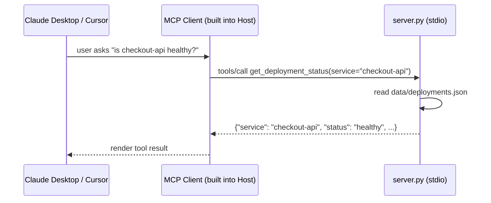

# Use Case 1: Build Your Own MCP Server

A minimal, fully offline MCP server exposing three internal-tooling-style tools, to teach
the mechanics of MCP before adding auth (see use-case-2) or real infrastructure (use-case-3,
use-case-4).

## Architecture



## Prerequisites

- Python 3.11+
- `pip install -r requirements.txt`

## Tools exposed

| Tool | Purpose | Side effects |
|---|---|---|
| `get_deployment_status(service)` | Look up mock deployment health for a service | None (read-only) |
| `search_knowledge_base(query)` | Keyword search over `data/knowledge_base/*.md` | None (read-only) |
| `create_support_ticket(title, description)` | File a ticket | Appends to `tickets.json` |

## Run the tests (no client needed)

```bash
pytest tests/ -v
```

`tests/test_tools.py` unit-tests each tool's logic directly. `tests/test_mcp_protocol.py`
spins up the real server over stdio and calls it through the MCP client SDK — the same path
a real client uses — proving the server works end to end without opening Claude or Cursor.

## Try it in Claude Desktop

1. Open Claude Desktop's config file (`claude_desktop_config.json` — Settings → Developer →
   Edit Config).
2. Merge in the contents of `claude_desktop_config.snippet.json`, replacing the placeholder
   path with the absolute path to this folder's `server.py`.
3. Restart Claude Desktop. Ask: "What's the deployment status of payments-service?"

## Try it in Cursor

1. Copy `.cursor/mcp.json` into this project's `.cursor/` folder (already done here).
2. Reload Cursor's MCP servers (Settings → MCP).
3. Ask the agent: "Search the knowledge base for the incident response process."

## Sample prompts to try

- "What's the deployment status of inventory-worker?"
- "Search the knowledge base for the deployment rollout process."
- "File a support ticket: title 'Rollback payments-service', description 'canary error rate
  spiked to 4% after v1.9.0'."
